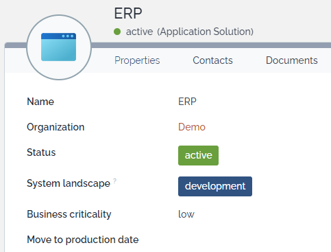

# iTop-br-landscape

Copyright (c) 2021-2025 Björn Rudner

## What?

iTop extension to add system landscape to functional CIs

## iTop Compatibility

The branch [2.7.10](https://github.com/rudnerbjoern/iTop-br-landscape/tree/itop/2.7.10) is compatible to iTop 2.7 and iTop 3.1.

The branch [main](https://github.com/rudnerbjoern/iTop-br-landscape/tree/main) will only be compatible to iTop 3.2.

Versions starting with 2.7.x are kept compatible to iTop 2.7

The extension was tested on iTop 2.7.10 and 3.2.1
